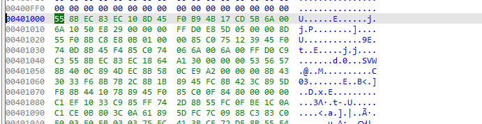
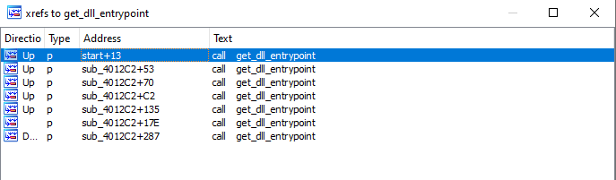

# Scenario
Our Threat Hunting team has detected suspicious network traffic originating from the workstation of a senior research scientist at DefenseTech Industries, a contractor developing next-generation missile defense systems. The suspicious traffic appears to be communicating with command and control C2 servers previously associated with the advanced persistent threat group known as Lazarus. Initial investigation reveals that the researcher recently received what appeared to be a legitimate job application email with a PDF attachment. Upon opening the attachment, a sophisticated loader was executed, which decrypted and deployed a variant of the RokRat remote access trojan. Our Incident Response team has extracted the shellcode loader component from the infected system for analysis
# Questions
## 1. What is the MD5 hash of the binary?
```bash
Get-FileHash -Algorithm MD5 -Path .\sample                                                                                                                                                                   Algorithm       Hash                                                                   Path                             ---------       ----                                                                   ----                             MD5             CF28EF5CEDA2AA7D7C149864723E5890
```

**CF28EF5CEDA2AA7D7C149864723E5890**

## 2. What is the entry point address of the binary in hex?


**0x401000**

## 3. What XOR key is used to decrypt the embedded shellcode in hex?
- In pseudocode, after take a look, I found that it has a function to load start address of shellcode
```bash
int (__stdcall *start())(_DWORD, _DWORD)
{
  char *v0; // eax
  int v1; // eax
  int (__stdcall *result)(_DWORD, _DWORD); // eax
  int v3; // [esp+0h] [ebp-10h] BYREF
  int (__stdcall *v4)(_DWORD, _DWORD); // [esp+4h] [ebp-Ch]

  v0 = list_dll_entrypoint((void *)0x5BCD174B);
  ((void (__stdcall *)(int *, int, _DWORD))v0)(&v3, 16, 0);
  v1 = get_shellcode_addr();
  result = (int (__stdcall *)(_DWORD, _DWORD))sub_401134(v1, &v3);
  if ( !result && v3 )
  {
    result = v4;
    if ( v4 )
      return (int (__stdcall *)(_DWORD, _DWORD))v4(0, 0);
  }
  return result;
}
```
- Inside get_shellcode_addr() (I renamed it), the code looks like:
```bash
int get_shellcode_addr()
{
  return 0x40158B;
}
```
- If I check `0x40158B` address, there are multiple bytes which begins with 0x29
```
.text:0040158B                 db 29h
.text:0040158C                 dd 0D8C00h, 29B97364h, 2929292Ah, 2929292Dh, 2929D6D6h
.text:004015A0                 dd 29292991h, 29292929h, 29292969h, 8 dup(29292929h), 29292801h
.text:004015D0                 dd 27933627h, 0E4209D29h, 65289108h, 417D08E4h, 59095A40h
.text:004015E4                 dd 5B4E465Bh, 4A094448h, 46474748h, 4C4B095Dh, 475C5B09h
.text:004015F8                 dd 9474009h, 97A666Dh, 4C4D4644h, 23242407h, 2929290Dh
.text:0040160C                 dd 29292929h, 0C82FEBE8h, 3 dup(9B418AACh), 9A45D35Eh
.text:00401624                 dd 9B418AA6h, 9A44D43Eh, 9B418A85h, 9BB01618h, 9B418ABFh
.text:00401638                 dd 9BB21618h, 9B418A1Ah, 9BB31618h, 9B418AB3h, 9BC5F2A5h
.text:0040164C                 dd 9B418AADh, 9B862A32h, 9B418AA8h, 9A42D497h, 9B418AB6h
.text:00401660                 dd 9BC2F2A5h, 9B418AADh, 9A44D349h, 9B418AAEh, 9A44D497h
.text:00401674                 dd 9B418AEAh, 9A45D497h, 9B418A88h, 9BD2F2A5h, 9B418AB7h
.text:00401688                 dd 9B408AACh, 9B418BB7h, 9A48D43Eh, 9B418ABCh, 9BBED43Eh
```
- Then it's definitely the shellcode, now we go to the next function. After getting shellcode address, it is pass to a function with a param
```bash
result = (int (__stdcall *)(_DWORD, _DWORD))sub_401134(v1, &v3);
```
- Look like a decoding function, let's check it
```bash
int __fastcall sub_401134(char *a1, int a2)
{
  char v2; // bl
  int v4; // edx
  _BYTE *v5; // ecx
  _BYTE *v6; // eax
  int v7; // esi
  int result; // eax

  v2 = *a1;
  v4 = *(_DWORD *)(a1 + 1);
  v5 = a1 + 5;
  if ( v4 )
  {
    v6 = v5;
    v7 = v4;
    do
    {
      *v6++ ^= v2;
      --v7;
    }
    while ( v7 );
  }
  result = sub_4012C2(a2);
  if ( result )
    return 13;
  return result;
}
```
- It's definitely the unxor function that takes the first byte of shellcode as xor key (v2=*a1), and the first byte of shellcode is 0x29 then this is the xor key

**0x29**

## 4. What is the memory protection constant used when allocating memory for the payload in hex?
- After debugging time: I mapped some hash to api name:
```bash
0x5BCD174B:ntdl_RtlFillMemory
0xAA7ADB76:kernel32_VirtualAlloc
0x234CCD4B:ntdl_RtlMovememory
0x26EB2DC1:kernel32_VirtualFree
0x406FAB8E:kernel32_LoadLibraryA
0xE99E570A:kernel32_GetProcAddress
```
- Check for `VirtualAlloc` function, I have
```bash
kernel32_VirtualAlloc = get_dll_entrypoint(0xAA7ADB76);
v7 = (kernel32_VirtualAlloc)(0, v42, 12288, 0x40);
```

**0x40**

## 5. What is the hash value used to find the VirtualAlloc function in hex?
- Refer to the previous question, the hash value is 0xAA7ADB76

**0xAA7ADB76**

## 6. How many bits does the DLL name hash algorithm rotate right (ROR) by in hex?
- Refer to this [link](https://github.com/tandasat/scripts_for_RE/blob/master/rotate.py), I know what is _ror4_() function, then in decompile code, it shifts 11 bit right to decode
```bash
if ( v5 )
    {
      v6 = Blink >> 16;
      v7 = 0;
      if ( v6 )
      {
        v8 = v23;
        do
        {
          v9 = __ROR4__(v3, 11);
          v24 = *(&v8->Flink + v7);
          if ( v24 < 97 )
            v3 = v24 + v9;
          else
            v3 = *(&v8->Flink + v7) - 32 + v9;
          ++v7;
        }
        while ( v7 < v6 );
        v10 = v21;
      }
```

**0xB**

## 7. What value is checked to verify a valid PE header in hex?
```bash
HEADER:004000E0 ; IMAGE_NT_HEADERS
HEADER:004000E0 dword_4000E0    dd 4550h                ; DATA XREF: HEADER:0040003C↑o
HEADER:004000E0                                         ; Signature
```

**0x4550**

## 8. What is the hexadecimal offset value used in the code to access the export directory in the PE file's Optional Header data directory?
In a PE file:
- DOS Header (starts with MZ) — 64 bytes
- `e_lfanew` (offset 0x3C) — points to the start of the PE Header
- PE Header — starts with PE\0\0
- File Header — 20 bytes
- Optional Header — starts immediately after the File Header
- In the Optional Header (for PE32):
    - At offset 0x60 from the start of the Optional Header: DataDirectory[0] — Export Directory RVA
    - Each entry in DataDirectory[] is 8 bytes: 4 bytes for RVA, 4 bytes for size
So the Export Directory RVA is located at:
    Offset = Start of Optional Header + 0x60 = relative offset
From the beginning of the PE header (after PE\0\0), this is at 0x78
- Also, if we check it NT_HEADER and export directory
```bash
HEADER:004000E0 ; IMAGE_NT_HEADERS
```
```bash
HEADER:00400158                 dd 2 dup(0)             ; Export Directory
```
- Then subtract it, we will find the offset 0x78

**0x78**

## 9. How many API functions are resolved using hashing in the entire binary?
- API function name is resolved by using get_dll_entrypoint() func, then check the reference to it will reveal the number of times being called


**7**

## 10. How many bytes of headers are skipped to reach the start of the decrypted data?
- Some first bytes of shellcode is:
`29 00 8C 0D 00 64 73 B9 29 2A 29 29 29 2D 29 29 29 D6 D6 29 29`
if we xor it with 0x29 (xorkey), then we has this
`00 29 A5 24 29 4D 5A 90 00 03 00 00 00 04 00 00 00 FF FF 00 00`
- 4D5A = MZ (special bytes for pe)
- or we can see it in decompile code
```bash
 v2 = *a1;
  v4 = *(a1 + 1);
  decoded_shellcode = a1 + 5;
  if ( v4 )
  {
    v6 = decoded_shellcode;
    v7 = v4;
    do
    {
      *v6++ ^= v2;
      --v7;
    }
    while ( v7 );
  }
```

**5**